# MCP Document Retriever Service 🌐💾🔎

## Overview 🌟

`mcp-doc-retriever` is a Dockerized FastAPI application designed to act as a Model Context Protocol (MCP) server, primarily for AI agents. Its core function is to download documentation content from various sources (Git repositories, websites via HTTPX/Playwright), store it locally, and provide API endpoints to manage downloads and search the retrieved content.

The service initiates downloads asynchronously, allowing agents to start a job and poll for its completion status using a unique `download_id`. It uses efficient `httpx` requests by default for web crawling but supports `playwright` for JavaScript-heavy pages. Git repositories can be cloned fully or using sparse checkout. Downloads are stored preserving the site/repo hierarchy within a persistent volume. A detailed index file is created for each download job, tracking URLs/files, local paths, and fetch statuses. The search functionality enables agents to first quickly scan relevant files for keywords and then perform precise text extraction using CSS selectors or analyse structured content blocks (code/JSON).

This project is intended to be built and potentially maintained using an agentic workflow, specifically following the Roomodes framework described below.

## ✨ Features

*   ✅ **Multi-Source Download:** Supports 'git', 'website' (HTTPX), and 'playwright' source types. *(Handled by `downloader` package)*
*   ✅ **Recursive Website Crawling:** Downloads HTML content starting from a URL, following links within the same domain (configurable depth). *(Handled by `downloader.web`)*
*   ✅ **Git Repository Cloning:** Clones Git repos, supports sparse checkout via `doc_path`. *(Handled by `downloader.git`)*
*   ✅ **Organized Storage:** Saves Git clones preserving the repository structure (`repo/`); saves web files in a flat structure per host using hashed filenames (`<host>/<url_base>-<hash>.<ext>`) within a persistent volume. *(Handled by `downloader` package & helpers)*
*   ✅ **Asynchronous Downloads & Status Polling:** Downloads run in the background via FastAPI `BackgroundTasks`. A dedicated `/status/{download_id}` endpoint allows agents to poll for task completion. *(Handled by `main.py`)*
*   ✅ **Download Indexing:** Maintains a JSON Lines index file per download job (`<download_id>.jsonl`), mapping original URLs/files to canonical URLs/paths, content MD5 hashes, and detailed fetch status. *(Generated by `downloader.web`, used by `searcher`)*
*   ✅ **Efficient Re-fetching/Cloning:** Avoids re-downloading/cloning if content exists unless overridden by `force=true`. *(Handled by `downloader` package)*
*   ✅ **Robots.txt Respect:** Checks and adheres to `robots.txt` rules for website crawling. *(Handled by `downloader.robots`)*
*   ✅ **Two-Phase Search (Job-Scoped):** *(Handled by `searcher` package)*
    1.  **Fast Scan:** Uses the index file to identify relevant local files for a specific `download_id`, then quickly scans the decoded text content for keywords. *(searcher.scanner)*
    2.  **Precise Extraction:** Parses candidate pages (identified by scan) using BeautifulSoup and applies CSS selectors to extract specific text content. Can further filter results by keywords. *(searcher.basic_extractor)*
*   ✅ **Advanced Content Block Extraction:** Can parse HTML/Markdown into structured blocks (text, code, JSON) for more targeted analysis. *(Handled by `searcher.advanced_extractor` and `searcher.helpers`)*
*   ✅ **Concurrency Control:** Uses `asyncio` Semaphores (web) and `ThreadPoolExecutor` (git/sync tasks).
*   ✅ **Structured I/O:** Uses Pydantic models for robust API request/response validation. *(models.py)*
*   ✅ **Dockerized & Self-Contained:** Packaged with `docker compose`, includes Playwright browser dependencies, uses a named volume for persistence.
*   ✅ **Configuration:** Supports configuration via environment variables or `config.json`. *(config.py)*
*   ✅ **Standard Packaging:** Uses `pyproject.toml` and `uv`.
*   ✅ **Modular Structure:** Code organized into `downloader` and `searcher` sub-packages.

## 🏗️ Runtime Architecture Diagram

```mermaid
graph TD
    subgraph "External Agent (e.g., Roo Code)"
        Agent -- "1. POST /download\n(DocDownloadRequest JSON)" --> FAPI
        AgentResp1 -- "2. TaskStatus (pending, download_id)" --> Agent
        Agent -- "3. GET /status/{download_id}\n(Repeat until completed/failed)" --> FAPI
        AgentResp2 -- "4. TaskStatus JSON" --> Agent
        Agent -- "5. POST /search\n(SearchRequest JSON - If completed)" --> FAPI
        AgentResp3 -- "6. List[SearchResultItem] JSON" --> Agent
    end

    subgraph "Docker Container: mcp-doc-retriever"
        FAPI("🌐 FastAPI - main.py") -- Manages --> TaskStore("📝 Task Status Store (SQLite DB - task_status.db)")
        FAPI -- Uses --> SharedExecutor("🔄 ThreadPoolExecutor")

        subgraph "Download Flow (Background Task)"
            direction TB
            FAPI -- Trigger --> BGTaskWrapper("🚀 Run Download Wrapper")
            BGTaskWrapper -- Update Status (running) --> TaskStore
            BGTaskWrapper -- "Params + Executor" --> Workflow("⚙️ Downloader Workflow - downloader/workflow.py")

            subgraph "Git Source"
                Workflow -- "Clone/Scan" --> GitDownloader("🐙 Git Downloader - downloader/git.py")
                GitDownloader -- "git cmd" --> SharedExecutor
                GitDownloader -- "File Scan" --> SharedExecutor
                GitDownloader -- "Files List" --> Workflow
            end

            subgraph "Web Source (Website/Playwright)"
                Workflow -- "Crawl" --> WebDownloader("🕸️ Web Downloader - downloader/web.py")
                WebDownloader -- "Check Robots" --> RobotsUtil("🤖 Robots Util - downloader/robots.py")
                WebDownloader -- "Fetch URL" --> Fetchers("⬇️ Fetchers - downloader/fetchers.py")
                Fetchers -- "HTTP" --> HttpxLib("🐍 httpx")
                Fetchers -- "Browser" --> PlaywrightLib("🎭 Playwright")
                HttpxLib --> TargetSite("🌍 Target Website/Repo")
                PlaywrightLib --> TargetSite
                TargetSite -- "Content" --> Fetchers
                Fetchers -- "Result" --> WebDownloader
                WebDownloader -- "Save Content + Log Index" --> Storage{{💾 Storage Volume}}
                WebDownloader -- "Extract Links" --> WebDownloader("Recursive Call")
            end

            Workflow -- "Result/Error" --> BGTaskWrapper
            BGTaskWrapper -- "Update Status (completed/failed)" --> TaskStore
        end

        subgraph "Search Flow"
            direction TB
            FAPI -- "Parse SearchRequest" --> SearcherCore("🔎 Searcher Core - searcher/searcher.py")
            SearcherCore -- "Read Index" --> Storage
            Storage -- "File Paths + URLs" --> SearcherCore
            SearcherCore -- "Paths + Keywords" --> Scanner("📰 Keyword Scanner - searcher/scanner.py")
            Scanner -- "Read Files" --> Storage
            Scanner -- "Candidate Paths" --> SearcherCore
            SearcherCore -- "Paths + Selector" --> BasicExtractor("✂️ Basic Extractor - searcher/basic_extractor.py")
            BasicExtractor -- "Read Files" --> Storage
            BasicExtractor -- "Snippets" --> SearcherCore
            SearcherCore -- "Format Results" --> FAPI
        end

        subgraph "Storage Volume (download_data)"
            direction TB
            Storage -- Contains --> IndexDir("index/*.jsonl")
            Storage -- Contains --> ContentDir("content/<download_id>/...")
        end
    end
```



*Diagram Key:* The diagram shows the agent interaction flow (1-6), the background task execution for downloads, and the synchronous flow for search. Components are labeled with their corresponding **updated module file paths**. The shared executor and storage volume are highlighted.

## 🛠️ Technology Stack

*   **Framework:** FastAPI
*   **Language:** Python 3.11+
*   **Containerization:** Docker, Docker Compose
*   **Web Crawling:** HTTPX (async HTTP requests), Playwright (for JavaScript rendering), Beautiful Soup 4 (HTML parsing), `python-robots.txt`
*   **Git Interaction:** Standard `git` CLI (invoked via `subprocess`)
*   **Asynchronous Execution:** `asyncio`, FastAPI `BackgroundTasks`, `ThreadPoolExecutor`
*   **Data Validation:** Pydantic
*   **CLI:** Typer
*   **Packaging:** `uv`
*   **Code Quality:** Ruff (linting & formatting)
*   **Logging:** Loguru

## 🤖 Roomodes Workflow (Project Construction)

This project adheres to the **Roomodes Agentic Development Framework**. This means its development and maintenance are intended to be driven by specialized AI agents operating within defined "modes" (roles) and governed by global rules.

*   **`.roomodes`:** Defines the roles (modes) like `Planner`, `Senior Coder`, `Tester`, `Reviewer`, etc., specifying their goals and constraints.
*   **`.roorules`:** Contains global constraints and guidelines applicable to all agents, ensuring consistency in coding style, documentation, testing, and error handling.
*   **`task.md`:** High-level plan outlining features, refactoring steps, testing phases, and documentation requirements, primarily used by the `Planner` agent.
*   **Agent Interaction:** The typical flow involves the `Planner` breaking down `task.md` into smaller sub-tasks, delegating coding tasks to `Senior Coder`, testing tasks to `Tester`, etc. Agents interact, review each other's work, and use provided documentation (`README.md`, `repo_docs/`, `lessons_learned` table in `project_state.db`) for context.

This agentic approach aims to automate parts of the development lifecycle, enforce standards, and potentially improve code quality and development speed, especially for well-defined MCP-style services.

## 📁 Project Structure (Refactored)

*Note: File paths below reflect the new structure.*
```
mcp-doc-retriever/
├── .git/
├── .gitignore
├── .env.example        # Example environment variables
├── .venv/              # Virtual environment (if used locally)
├── .roomodes           # Agent mode definitions
├── .roorules           # Global rules governing agent behavior
├── docker-compose.yml  # Docker Compose service definition
├── Dockerfile          # Docker image build instructions
├── pyproject.toml      # Project metadata and dependencies (for uv/pip)
├── uv.lock             # Pinned dependency versions
├── README.md           # This file
├── task.md             # High-level task plan for Planner agent
├── config.json         # Optional local config file (overridden by env vars)
├── repo_docs/          # Downloaded third-party documentation for agent reference
│   └── ...
├── scripts/
│   └── test_runner.sh  # Legacy E2E script (See Testing section for current strategy)
├── tests/              # Automated tests
│   ├── __init__.py
│   ├── conftest.py       # Pytest fixtures (if needed)
│   ├── unit/             # Unit tests (testing isolated functions/classes)
│   │   └── ...
│   ├── integration/      # Integration tests (testing component interactions)
│   │   └── ...
│   └── test_mcp_retriever_e2e_loguru.py # Main E2E test script (Python/Pytest/Loguru)
└── src/
    └── mcp_doc_retriever/ # Main application source code
        ├── __init__.py       # Make src/mcp_doc_retriever a package
        ├── cli.py            # Main CLI entry point (Typer app)
        ├── config.py         # Configuration loading
        ├── main.py           # FastAPI app, API endpoints, status store
        ├── models.py         # Pydantic models (API, Index, Status, ContentBlock)
        ├── utils.py          # Shared utilities (URL canonicalization, SSRF check, keyword matching)
        ├── example_extractor.py # Utility to extract JSON examples post-download
        ├── downloader/       # --- Sub-package for Downloading ---
        │   ├── __init__.py   # Make downloader a package
        │   ├── workflow.py   # Main download orchestration logic
        │   ├── git.py        # Git clone/scan logic
        │   ├── web.py        # Web crawling logic
        │   ├── fetchers.py   # HTTPX and Playwright fetch implementations
        │   ├── robots.py     # robots.txt parsing logic
        │   └── helpers.py    # Downloader-specific helpers (e.g., url_to_local_path)
        ├── searcher/         # --- Sub-package for Searching ---
        │   ├── __init__.py   # Make searcher a package
        │   ├── searcher.py     # Basic search orchestration (perform_search)
        │   ├── scanner.py      # Keyword scanning logic
        │   ├── basic_extractor.py # Basic text snippet extraction
        │   ├── advanced_extractor.py # Advanced block-based extraction
        │   └── helpers.py    # Search-specific helpers (file access, content parsing)
        └── docs/             # Internal documentation and agent aids

# Download data lives in the Docker volume 'download_data', mapped to /app/downloads.
# /app/downloads/index/ contains *.jsonl index files
# /app/downloads/content/<download_id>/ contains downloaded files/repo clones
```

## ⚙️ Configuration

The service can be configured via environment variables (recommended for Docker deployment) or a `config.json` file located in the project root (useful for local development). Environment variables take precedence.

**Key Environment Variables:**

*   `DOWNLOAD_BASE_DIR`: Path inside the container where downloads are stored (defaults to `/app/downloads`). Mapped to the `download_data` volume in `docker-compose.yml`.
*   `DEFAULT_WEB_DEPTH`: Default recursion depth for website crawls if not specified in the API request (defaults to 5).
*   `DEFAULT_WEB_CONCURRENCY`: Default max concurrent download requests for web crawls (defaults to 50).
*   `DEFAULT_REQUEST_TIMEOUT`: Default timeout in seconds for individual HTTP requests (defaults to 30).
*   `DEFAULT_PLAYWRIGHT_TIMEOUT`: Default timeout in seconds for Playwright operations (defaults to 60).
*   `MAX_FILE_SIZE_BYTES`: Maximum size for downloaded files (defaults to 10MB, 0 for unlimited). Prevents accidental download of huge assets.
*   `USER_AGENT_STRING`: Custom User-Agent string for HTTP requests (includes download ID for tracking).
*   `LOG_LEVEL`: Set application log level (e.g., `INFO`, `DEBUG`).

See `.env.example` for a template and `src/mcp_doc_retriever/config.py` for implementation details.

## 🛠️ MCP Server Configuration Example

To use this service as an MCP server, an agent would typically need configuration like this:

```json
{
  "mcp_server_url": "http://localhost:8001", // Or the deployed URL
  "tool_name": "mcp_document_retriever",
  "description": "Downloads and searches documentation from Git repos or websites.",
  "parameters": {
    "download": {
      "source_type": "'git', 'website', or 'playwright'",
      "url": "URL for website/playwright or Git repo HTTPS URL",
      "repo_url": "(Optional, Alias for url if source_type is git)",
      "depth": "(Optional, Integer) Max crawl depth for website/playwright (default 5)",
      "doc_path": "(Optional, String) Path within Git repo for sparse checkout (default '.')",
      "force": "(Optional, Boolean) Force re-download/clone even if exists (default false)",
      "download_id": "(Optional, String) Specify a custom ID (UUID generated if omitted)"
    },
    "status": {
      "download_id": "(Required, String) The ID of the download task to check"
    },
    "search": {
      "download_id": "(Required, String) The ID of the completed download to search within",
      "scan_keywords": "(Optional, List[String]) Keywords to quickly scan for in file content",
      "extract_selector": "(Optional, String) CSS selector to extract specific content (e.g., 'article .content', 'pre code')",
      "extract_keywords": "(Optional, List[String]) Keywords to filter extracted snippets by"
    }
  },
  "expected_output": {
    "download": "{'download_id': '...', 'status': 'pending'}",
    "status": "{'download_id': '...', 'status': 'running|completed|failed', 'details': '...', 'error_details': '...'}",
    "search": "[{'source': '...', 'local_path': '...', 'match_details': '...', 'relevance_score': 0.0, 'content_block': null}]"
  }
}
```

## 🛠️ Setup & Installation

**Prerequisites:**

*   Docker & Docker Compose
*   Git (for cloning this repo and for the service to clone other repos)
*   Python 3.11+ and `uv` (recommended for local development/testing)

**Steps:**

1.  **Clone the repository:**
    ```bash
    git clone https://github.com/your-username/mcp-doc-retriever.git # Replace with your repo URL
    cd mcp-doc-retriever
    ```
2.  **Build the Docker image:**
    ```bash
    docker compose build
    ```
    *(This installs dependencies using `uv` inside the container based on `pyproject.toml` and `uv.lock`)*
3.  **(Optional) Local Development Setup:**
    *   Create a virtual environment: `python -m venv .venv` (or use `uv venv`)
    *   Activate it: `source .venv/bin/activate`
    *   Install dependencies: `uv pip install -r requirements-dev.txt` (or `uv pip install -e .[dev]` if setup correctly in pyproject.toml)

## 🚀 Running the Service

1.  **Start the service using Docker Compose:**
    ```bash
    docker compose up -d
    ```
    *   This starts the FastAPI server in a container, typically listening on `http://localhost:8001`.
    *   It also creates/uses the named volume `download_data` for persistent storage.
2.  **View Logs:**
    ```bash
    docker logs mcp-doc-retriever -f
    ```
3.  **Stop the service:**
    ```bash
    docker compose down
    ```
    *   Add `-v` to remove the `download_data` volume if you want to clear all downloaded content: `docker compose down -v`

## 💻 API Usage

Interact with the running service via HTTP requests (e.g., using `curl`, Python `requests`, or an agent framework).

*   **POST `/download`**
    *   **Purpose:** Initiate a new download job.
    *   **Request Body:** `DocDownloadRequest` (see `models.py`)
        *   `source_type`: "git", "website", or "playwright" (required)
        *   `url` or `repo_url`: Source location (required)
        *   `depth`, `doc_path`, `force`, `download_id` (optional)
    *   **Response:** `TaskStatus` model (`202 Accepted` on success)
        ```json
        {
          "download_id": "generated-or-provided-uuid",
          "status": "pending",
          "details": "Download task accepted and queued.",
          "error_details": null
        }
        ```
*   **GET `/status/{download_id}`**
    *   **Purpose:** Check the status of an ongoing or completed download job.
    *   **Path Parameter:** `download_id` (string, required)
    *   **Response:** `TaskStatus` model (`200 OK` if found, `404 Not Found` otherwise)
        ```json
        // Example: Completed
        {
          "download_id": "some-uuid",
          "status": "completed",
          "details": "Download finished. Processed X files/pages.",
          "error_details": null
        }
        // Example: Failed
        {
          "download_id": "some-uuid",
          "status": "failed",
          "details": "Download failed during processing.",
          "error_details": "Specific error message, e.g., Git clone failed..."
        }
        ```
*   **POST `/search`**
    *   **Purpose:** Search within the content of a *completed* download job.
    *   **Request Body:** `SearchRequest` (see `models.py`)
        *   `download_id`: Target download job (required)
        *   `scan_keywords`: List of keywords to quickly find relevant files (optional)
        *   `extract_selector`: CSS selector for targeted extraction (optional)
        *   `extract_keywords`: List of keywords to filter extracted snippets (optional)
    *   **Response:** List of `SearchResultItem` models (`200 OK` on success, `404 Not Found` if `download_id` invalid, `400 Bad Request` if search params invalid)
        ```json
        [
          {
            "source": "https://example.com/page1", // Original URL or file path
            "local_path": "/app/downloads/content/some-uuid/example.com/http_example.com_page1-hash.html", // Path in volume
            "match_details": "Snippet of text matching keywords or extracted via selector...",
            "relevance_score": 0.85, // Optional score
            "content_block": null // Or populated by advanced extractor
          }
          // ... more results
        ]
        ```
*   **GET `/health`**
    *   **Purpose:** Simple health check endpoint.
    *   **Response:** `200 OK` with `{"status": "healthy"}`

## 🤔 Key Concepts Explained

*   **Download ID:** A unique identifier (UUID by default) for each download job. Used for status polling and searching within that job's content.
*   **Index File (`.jsonl`):** A log file created for each download job, stored in the `index/` directory within the volume. Each line is a JSON object (`IndexRecord`) representing a single URL or file processed, containing its canonical URL, local path, fetch status, content hash, etc. This is crucial for the search scanner.
*   **Asynchronous Processing:** Downloads are handled by background tasks, allowing the API to respond immediately while the actual work happens separately. Status polling is necessary to know when it's done.
*   **Search Scoping:** Searches are always scoped to a specific `download_id`. You cannot search across multiple download jobs simultaneously with a single API call.
*   **Flat Web Paths:** Website content is stored using `<host>/<url_base>-<hash>.<ext>` to avoid deeply nested directories and potential path length issues, while still organizing by host and providing collision resistance via hashing. The index file maps the original URL to this flat path.

## 🧪 Testing Strategy

This project employs a multi-phase testing strategy to ensure robustness from individual modules up to the final containerized application:

1.  **Phase 0: Standalone Module Verification:**
    *   **Goal:** Ensure basic syntax and functionality of core Python modules.
    *   **Method:** Each critical module (`*.py` in `src/mcp_doc_retriever` excluding `main.py`, `cli.py`, `config.py`) includes an `if __name__ == "__main__":` block demonstrating its core functionality. These are executed individually using `uv run <path/to/module.py>`.
    *   **See:** `task.md` Phase 0 for the list of modules.

2.  **Phase 1: Unit & Integration Tests:**
    *   **Goal:** Test individual functions and component interactions locally without requiring the full API or Docker.
    *   **Method:** Uses `pytest` with tests located in `tests/unit` and `tests/integration`. Covers utility functions, helper logic, downloader components (using mock servers/local repos), and searcher components (using fixture data). **Crucially, these tests validate the flat/hashed path structure (`<host>/<url_base>-<hash>.<ext>`) generated for web downloads and its correct recording in index files (`local_path`).**
    *   **Command:** `uv run pytest tests/unit tests/integration`

3.  **Phase 2: Local API & CLI End-to-End Testing:**
    *   **Goal:** Verify the FastAPI application and CLI commands function correctly in the local development environment *before* containerization.
    *   **Method:**
        *   The FastAPI server is run locally using `uvicorn` (e.g., `uv run uvicorn src.mcp_doc_retriever.main:app --port 8005`).
        *   An automated Python E2E script (`tests/test_mcp_retriever_e2e_loguru.py`) is executed using `pytest`, targeting the *local* API endpoint (e.g., `MCP_TEST_BASE_URL="http://localhost:8005" uv run pytest ...`). This validates API logic, background task initiation, and basic responses. (Note: Tests requiring `docker exec` will be skipped or fail in this phase).
        *   CLI commands are run directly on the host (e.g., `uv run python -m mcp_doc_retriever.cli download run ...`) to verify their execution and local file output structure.
    *   **See:** `task.md` Phase 2 for specific commands and checks.

4.  **Phase 3: Docker End-to-End Testing:**
    *   **Goal:** Verify the application works correctly within the full Docker environment, including volumes and networking.
    *   **Method:**
        *   Containers are built and run using `docker compose build` and `docker compose up -d`.
        *   The automated Python E2E script (`tests/test_mcp_retriever_e2e_loguru.py`) is executed using `pytest`, targeting the *Docker* API endpoint (e.g., `http://localhost:8001`). This run validates all aspects, including interactions with the container filesystem via `docker exec`.
    *   **See:** `task.md` Phase 3 for specific commands and checks.

**Running Tests:**

*   Run unit/integration tests: `uv run pytest tests/unit tests/integration`
*   Run local E2E tests (requires local server on port 8005): `MCP_TEST_BASE_URL="http://localhost:8005" uv run pytest -v -s tests/test_mcp_retriever_e2e_loguru.py`
*   Run Docker E2E tests (requires Docker containers running): `uv run pytest -v -s tests/test_mcp_retriever_e2e_loguru.py`
*   Run specific tests using `pytest -k <keyword>` or `pytest -m <marker>`.

*(Note: The project uses Loguru for enhanced logging during tests and application runtime. Use `-s` with pytest to see detailed output.)*

## 📚 Documentation Standards

This project adheres to specific documentation standards, primarily governed by the `.roorules` file:

*   **Module Docstrings:** Every core `.py` file within `src/mcp_doc_retriever/` **must** include a module-level docstring at the top containing:
    *   A clear **description** of the module's purpose.
    *   Direct **links** to the official documentation for any third-party packages used within that module.
    *   A concrete **sample input** and the corresponding **expected output** for the module's primary function(s).
*   **Standalone Verification Block:** Every core `.py` file **must** include a functional `if __name__ == "__main__":` block. This block should contain code that provides a **minimal, real-world usage example** demonstrating and verifying the core functionality of that specific module *independently*, without relying on the full FastAPI server or Docker environment.
*   **Code Comments:** Use inline comments (`#`) to explain complex algorithms, business logic decisions, assumptions, or potential workarounds that aren't immediately obvious from the code itself.
*   **README Accuracy:** This `README.md` file should be kept up-to-date with the project's features, API specifications, setup instructions, and core concepts.
*   **Agent Knowledge Base:**
    *   **Lessons Learned:** Reusable solutions, non-obvious fixes, or valuable insights discovered during development (especially by agents) are logged in the `lessons_learned` table in the `project_state.db` SQLite database.
    *   **Repository Docs:** Relevant documentation for third-party libraries used in the project should be stored in the `repo_docs/` directory for agent reference.
```

.