# MCP Document Retriever Service 🌐💾🔎

## Overview 🌟

`mcp-doc-retriever` is a Dockerized FastAPI application designed to act as a Model Context Protocol (MCP) server, primarily for AI agents. Its core function is to recursively download website content (HTML documentation), store it locally in a structured format, and provide API endpoints to manage downloads and search the retrieved content.

The service initiates downloads asynchronously, allowing agents to start a job and poll for its completion status. It uses efficient `httpx` requests by default but supports `playwright` for JavaScript-heavy pages via an API flag. Downloads are stored preserving the site hierarchy (`hostname/path/file.html`) within a persistent volume. A detailed index file is created for each download job, tracking URLs, local paths, and fetch statuses. The search functionality enables agents to first quickly scan relevant files for keywords and then perform precise text extraction using CSS selectors.

This project is intended to be built and potentially maintained using an agentic workflow, specifically following the Roomodes framework described below.

## ✨ Features

*   ✅ **Recursive Website Download:** Downloads HTML content starting from a URL, following links within the same domain (configurable depth).
*   ✅ **Mirrored Storage:** Saves downloaded files locally preserving the original site's directory structure (e.g., `hostname/path/file.html`) within a persistent volume.
*   ✅ **Flexible Fetching:** Uses `httpx` by default. Supports forcing Playwright via API flag (`use_playwright`) for JS-heavy pages.
*   ✅ **Asynchronous Downloads & Status Polling:** Downloads run in the background. A dedicated `/status/{download_id}` endpoint allows agents to poll for task completion (`completed` or `failed`).
*   ✅ **Download Indexing:** Maintains a JSON Lines index file per download job (`<download_id>.jsonl`), mapping original URLs to canonical URLs, local file paths, content MD5 hashes, and detailed fetch status (`success`, `failed_request`, `skipped`, etc.).
*   ✅ **Efficient Re-fetching:** Avoids re-downloading files if they already exist at the target path unless overridden by `force=true`.
*   ✅ **Robots.txt Respect:** Checks and adheres to `robots.txt` rules before fetching URLs.
*   ✅ **Two-Phase Search (Job-Scoped):**
    1.  **Fast Scan:** Uses the index file to identify relevant local files for a specific `download_id`, then quickly scans the decoded text content for keywords.
    2.  **Precise Extraction:** Parses candidate pages (identified by scan) using BeautifulSoup and applies CSS selectors to extract specific text content. Can further filter results by keywords within the extracted text.
*   ✅ **Concurrency Control:** Uses `asyncio` Semaphores to limit concurrent `httpx` requests and Playwright browser instances.
*   ✅ **Structured I/O:** Uses Pydantic models for robust API request/response validation.
*   ✅ **Dockerized & Self-Contained:** Packaged with `docker compose`, includes Playwright browser dependencies in the image, uses a named volume for persistent storage.
*   ✅ **Configuration:** Supports configuration via environment variables or a `config.json` file.
*   ✅ **Standard Packaging:** Uses `pyproject.toml` and `uv`.

## 🏗️ Runtime Architecture Diagram

```mermaid
graph TD
    subgraph "External Agent (e.g., Roo Code)"
        Agent -- "1. POST /download\n(DownloadRequest JSON)" --> FAPI
        AgentResp1 -- "2. download_id" --> Agent
        Agent -- "3. GET /status/{download_id}\n(Repeat until completed/failed)" --> FAPI
        AgentResp2 -- "4. TaskStatus JSON" --> Agent
        Agent -- "5. POST /search\n(SearchRequest JSON - If completed)" --> FAPI
        AgentResp3 -- "6. List[SearchResultItem] JSON" --> Agent
    end

    subgraph "Docker Container: mcp-doc-retriever"
        FAPI("🌐 FastAPI - main.py") -- Manages --> TaskStore("📝 Task Status Store")

        subgraph "Download Flow"
            direction TB
            FAPI -- Parse Request --> Utils("🔧 Utils - utils.py")
            Utils -- Canonical URL --> FAPI
            FAPI -- Create Task Entry (pending) --> TaskStore
            FAPI -- Generate download_id --> BGTask{"🚀 Start Background Task"}
            BGTask -- Update Status (running) --> TaskStore
            BGTask -- Orchestrate --> Downloader("⚙️ Async Downloader - downloader.py")

            Downloader -- "URL" --> Utils
            %% Canonicalize for Visited Check
            Downloader -- "Check Robots" --> Robots("🤖 Robots.py")
            Downloader -- "Check Path Exists?" --> ContentFS("📁 Content Volume - /app/downloads/content")
            Downloader -- "Fetch" --> FetchChoice{"Use Playwright Flag?"}
            FetchChoice -- "httpx" --> RequestsLib("🐍 httpx")
            FetchChoice -- "Playwright" --> PlaywrightLib("🎭 Playwright")
            RequestsLib -- "Fetch" --> TargetSite("🌍 Target Website")
            PlaywrightLib -- "Render & Fetch" --> TargetSite
            TargetSite -- "HTML" --> FetchResult{"Content + Status"}
            FetchResult -- "Calculate MD5" --> Downloader
            FetchResult -- "Save Content" --> ContentFS
            %% Save to hostname/path/file.html
            Downloader -- "Log Attempt" --> IndexFS("💾 Index Volume - /app/downloads/index")
            %% Write IndexRecord to {download_id}.jsonl
            FetchResult -- "Extract Links (BS4)" --> LinkQueue("/Links/")
            LinkQueue -- "Next URL" --> Downloader
            %% Recursive Loop (Check Domain/Depth/Visited/Robots)

            BGTask -- "Update Status (completed/failed)" --> TaskStore
            Downloader -- "Errors" --> BGTask
            %% Report errors to wrapper
        end

        subgraph "Status Check Flow"
            direction TB
            FAPI -- "Get download_id" --> TaskStore
            TaskStore -- "Return Status" --> FAPI
        end

        subgraph "Search Flow"
            direction TB
            FAPI -- "Parse SearchRequest" --> Searcher("🔎 Searcher - searcher.py")
            Searcher -- "Read Index File (download_id)" --> IndexFS
            IndexFS -- "Relevant Local Paths" --> Searcher
            Searcher -- "Phase 1: Scan Keywords" --> ContentFS
            %% Read content from relevant paths
            ContentFS -- "Content" --> ScanFunc("📜 Decode & Scan Text")
            ScanFunc -- "Candidate Paths" --> Searcher
            Searcher -- "Phase 2: Parse & Extract" --> ContentFS
            %% Read content from candidate paths
            ContentFS -- "Content" --> ExtractFunc("🌳 BS4 Parse & Select Text")
            ExtractFunc -- "Extracted Text" --> Searcher
            Searcher -- "Lookup Original URL" --> IndexFS
            %% Use index to map path back to URL
            Searcher -- "Formatted Results" --> FAPI
        end
    end
```



*Diagram Key:* The diagram shows the agent interaction flow (1-6), including the status polling step. Internal components like the downloader, fetchers, searcher, utils, and storage (index/content volumes, task status store) are depicted.

## 🛠️ Technology Stack

*   **Language:** Python 3.11+
*   **Web Framework:** FastAPI
*   **Async HTTP Client:** HTTPX
*   **Browser Automation:** Playwright (Chromium)
*   **HTML Parsing:** BeautifulSoup4
*   **Data Validation:** Pydantic
*   **Concurrency:** Asyncio (with Semaphores)
*   **Containerization:** Docker, Docker Compose
*   **Dependency Management:** uv, pyproject.toml
*   **Async File I/O:** aiofiles
*   **Logging:** Python standard logging library

## 🤖 Roomodes Workflow (Project Construction)

This project utilizes the **Roomodes framework** for agentic development. The process is orchestrated through specific agent roles defined in the `.roomodes` file and governed by rules in `.roorules`.

**Core Workflow:**

1.  **Planner (`📝 Planner`):**
    *   Starts by reading `task.md` to identify the next pending task `[ ]`.
    *   Delegates the entire task description to `Boomerang Mode` using the `new_task` tool.
    *   Upon receiving overall task success from Boomerang Mode, the Planner:
        *   Consults `src/mcp_doc_retriever/docs/lessons_learned.json`.
        *   Performs `git add .`, `git commit`, and `git tag` actions.
        *   Logs any *planning-specific* lessons learned.
        *   Updates `task.md` to mark the task complete `[X]`.
        *   Proceeds to the next task.
    *   If Boomerang Mode reports failure, the Planner consults lessons learned and escalates the issue to a human supervisor via `ask_human`.

2.  **Orchestrator (`🪃 Boomerang Mode`):**
    *   Receives high-level tasks from Planner.
    *   Analyzes the task and plans necessary functional sub-steps.
    *   Delegates sub-tasks sequentially to specialist agents (Coders, Researcher, etc.) via `new_task`.
    *   **For Coding Tasks:** Manages a standard sequence:
        *   **Development:** Delegate to Coder (`Intern`, `Junior`, `Senior`/`code`).
        *   **Demonstration (Mandatory):** Delegate verification to `Presenter` after code completion. Manage demo-fix loops (Presenter -> Coder -> Presenter).
        *   **Security Testing (Mandatory):** Delegate to `Hacker` *after* successful demo. Manage remediation loops (Hacker -> Coder -> Hacker).
        *   **Refactoring (Optional):** Delegate to `Refactorer` *after* security clearance.
    *   Monitors specialist results, prompts for lessons learned based on novelty/complexity.
    *   Logs *orchestration-specific* lessons learned.
    *   Reports overall task success or failure back to Planner, including context from failing specialists and lessons learned lookups on failure.

3.  **Specialists (Coders, Hacker, Presenter, Researcher, Librarian, Refactorer):**
    *   Execute specific tasks delegated by Boomerang Mode.
    *   Follow detailed instructions and global rules (`.roorules`).
    *   **Error Handling:** Adhere to standard procedure: consult `lessons_learned.json`, then `repo_docs/`, then use `perplexity-ask` for external research (specific modes may have variations).
    *   **Verification (Coders/Refactorer):** Crucially, **must** successfully execute the modified script's `if __name__ == '__main__':` block standalone via `uv run` after *any* code edit and before reporting completion. This includes testing download/search with real URLs and content checks.
    *   **Self-Recovery (Coders/Refactorer):** If edits break the code and standard error handling fails, **must** attempt to `git checkout -- <file>` to revert changes before reporting failure.
    *   **Lesson Logging:** Log novel techniques/workarounds to `lessons_learned.json` (except Intern Coder and Presenter).
    *   Report detailed results, rationale, verification steps, and success/failure back to Boomerang Mode.

**Key Governing Rules (`.roorules`):**

*   **Standalone Verification:** All code edits must pass `if __name__ == '__main__':` execution via `uv run`.
*   **Error Handling Procedure:** Lessons KB -> Repo Docs -> Perplexity Search.
*   **Self-Recovery:** Attempt `git checkout` on failed edits before reporting failure.
*   **Lesson Logging:** Standardized format and trigger conditions.
*   **Async Debugging:** Emphasis on deep logging and error propagation.
*   **Tool Usage:** Use `uv` for installs, `uv run` for execution.
*   **Module Documentation:** Core modules require specific docstring content (description, links, sample I/O) and a functional `__main__` block (see Documentation Standards below).

*(Refer to the `.roomodes` and `.roorules` files for complete, detailed instructions for each agent and global behaviors.)*

## 📁 Project Structure

```
mcp-doc-retriever/
├── .git/
├── .gitignore
├── .env.example        # Example environment variables
├── .venv/              # Virtual environment (if used locally)
├── .roomodes           # Agent mode definitions for Roomodes framework
├── .roorules           # Global rules governing agent behavior
├── docker-compose.yml  # Docker Compose service definition
├── Dockerfile          # Docker image build instructions
├── pyproject.toml      # Project metadata and dependencies (for uv/pip)
├── uv.lock             # Pinned dependency versions
├── README.md           # This file
├── task.md             # High-level task plan for Planner agent
├── config.json         # Optional local config file (overridden by env vars)
├── repo_docs/          # Downloaded third-party documentation for agent reference
│   └── ...
├── scripts/
│   └── test_runner.sh  # End-to-end sanity check script
└── src/
    └── mcp_doc_retriever/ # Main application source code
        ├── __init__.py
        ├── main.py           # FastAPI app, API endpoints, status store
        ├── models.py         # Pydantic models (API, Index, Status)
        ├── downloader.py     # Download orchestration logic
        ├── fetchers.py       # httpx and Playwright fetching implementations
        ├── searcher.py       # Two-phase search logic
        ├── config.py         # Configuration loading (env vars, config.json)
        ├── utils.py          # Helper functions (URL, path, semaphores)
        ├── robots.py         # robots.txt parsing logic
        └── docs/             # Internal project documentation and agent knowledge
            └── lessons_learned.json # Agent lessons learned knowledge base

# Note: Download data lives in the Docker volume 'download_data',
# mapped to /app/downloads inside the container.
# /app/downloads/index/ contains *.jsonl index files
# /app/downloads/content/ contains hostname/path/file.html structure
```

## ⚙️ Configuration

The application uses the following configuration sources, in order of precedence:

1.  **Environment Variables:** (Recommended for Docker deployments)
    *   `MCP_DOWNLOAD_BASE_DIR`: Overrides the base directory for downloads (Default: `./downloads` relative to project root, resolved to absolute path `/app/downloads` in container).
    *   `MCP_TIMEOUT_REQUESTS`: Overrides default timeout for `httpx` requests (Default: 30 seconds).
    *   *(Add other environment variables corresponding to config options as needed)*
2.  **`config.json` File:** A JSON file placed in the project root. Example:
    ```json
    {
      "DOWNLOAD_BASE_DIR": "./custom_downloads_from_file",
      "TIMEOUT_REQUESTS": 45
    }
    ```
3.  **Default Values:** Defined within the `src/mcp_doc_retriever/config.py` and `src/mcp_doc_retriever/utils.py` modules.

The final `DOWNLOAD_BASE_DIR` path is always resolved to an absolute path. Inside the Docker container, the relevant base path is `/app/downloads`, which is mapped to the persistent `download_data` volume.

## 🛠️ Setup & Installation

**Prerequisites:**

*   Docker Desktop (or Docker Engine)
*   Docker Compose
*   Git

**Steps:**

1.  **Clone the Repository:**
    ```bash
    git clone <repository-url>
    cd mcp-doc-retriever
    ```
2.  **(Optional) Create `.env` File:**
    *   If you need to customize settings (like the host port mapping if 8001 is taken), copy `.env.example` to `.env` and modify it.

## 🚀 Running the Service

1.  **Build and Start:**
    ```bash
    docker compose up --build -d
    ```
    *   `--build`: Builds the Docker image using `Dockerfile`.
    *   `-d`: Runs the container in detached (background) mode.
    *   This command also creates/attaches the `download_data` volume and maps host port `8001` to container port `8000`.
2.  **Verify Service:**
    *   Check container status: `docker compose ps`
    *   View logs: `docker logs mcp-doc-retriever -f` (Press Ctrl+C to stop following)
    *   Check health endpoint: `curl http://localhost:8001/health` (Should return `{"status":"healthy"}`)
3.  **Stopping the Service:**
    ```bash
    docker compose down
    ```
    *   Stops and removes the container. The `download_data` volume persists.
4.  **Stopping and Removing Data:**
    ```bash
    docker compose down -v
    ```
    *   Stops and removes the container AND the `download_data` volume (downloaded files will be lost).

## 💻 API Usage

The service exposes the following endpoints, accessible by default at `http://localhost:8001`.

### 1. Initiate Download

*   **Endpoint:** `POST /download`
*   **Purpose:** Initiates the recursive download process for a given URL. **Returns immediately** with a `download_id`. The actual download runs in the background.
*   **Request Body:** (`DownloadRequest` model - see `models.py`)
    ```json
    {
      "url": "https://docs.python.org/3/library/asyncio.html",
      "force": false,
      "depth": 1,
      "use_playwright": false,
      "timeout": 45,
      "max_file_size": 10485760
    }
    ```
    *   *(See `models.py` docstring for field details)*
*   **Response Body (On Success):** (`DownloadStatus` model)
    ```json
    {
      "status": "started",
      "message": "Download initiated for https://docs.python.org/3/library/asyncio.html",
      "download_id": "a1b2c3d4-e5f6-7890-abcd-ef1234567890" // UUID
    }
    ```
*   **Response Body (On Validation Error):** (`DownloadStatus` model)
    ```json
    {
      "status": "failed_validation",
      "message": "Invalid URL format: ...",
      "download_id": null
    }
    ```
*   **Agent Action:** Store the `download_id` and proceed to poll the `/status` endpoint.

### 2. Check Download Status

*   **Endpoint:** `GET /status/{download_id}`
*   **Purpose:** Poll this endpoint to check the status of a background download task.
*   **Path Parameter:**
    *   `download_id` (str, required): The UUID received from the `/download` response.
*   **Response Body (On Success - 200 OK):** (`TaskStatus` model - see `models.py`)
    ```json
    // Example: Running
    {
      "status": "running",
      "message": "Download process starting...",
      "start_time": "2023-10-27T10:00:00.123456",
      "end_time": null,
      "error_details": null
    }

    // Example: Completed
    {
      "status": "completed",
      "message": "Download finished successfully.",
      "start_time": "2023-10-27T10:00:00.123456",
      "end_time": "2023-10-27T10:05:30.987654",
      "error_details": null
    }

    // Example: Failed
    {
      "status": "failed",
      "message": "Download failed: TimeoutException",
      "start_time": "2023-10-27T10:00:00.123456",
      "end_time": "2023-10-27T10:02:15.112233",
      "error_details": "Timeout connecting to host example.com...\nTraceback: ..."
    }
    ```
    *   `status`: Can be `pending`, `running`, `completed`, or `failed`.
    *   Other fields provide context (timestamps, messages, error details).
*   **Response Body (On Error - 404 Not Found):** If the `download_id` is unknown.
*   **Agent Action:** Poll periodically (e.g., every 5-10 seconds) until `status` is `completed` or `failed`. If `completed`, proceed to search. If `failed`, handle the error. Implement a timeout for polling.

### 3. Search Downloaded Content

*   **Endpoint:** `POST /search`
*   **Purpose:** Searches through downloaded content associated with a specific *completed* `download_id`.
*   **Prerequisite:** The agent should have confirmed the download task reached `completed` status via the `/status/{download_id}` endpoint.
*   **Request Body:** (`SearchRequest` model - see `models.py`)
    ```json
    {
      "download_id": "a1b2c3d4-e5f6-7890-abcd-ef1234567890", // ID of a completed download
      "scan_keywords": ["event loop", "coroutine"],
      "extract_selector": "div.section > pre.highlight-python",
      "extract_keywords": ["async def", "await"]
    }
    ```
    *   *(See `models.py` docstring for field details)*
*   **Response Body (On Success):** `List[SearchResultItem]` (`SearchResultItem` from `models.py`)
    ```json
    [
      {
        "original_url": "https://docs.python.org/3/library/asyncio-task.html",
        "extracted_content": "async def main():\n    print('hello')\n    await asyncio.sleep(1)\n    print('world')",
        "selector_matched": "div.section > pre.highlight-python"
      }
      // ... more results
    ]
    ```
*   **Response Body (On Error):** HTTP 404 (if `download_id` index not found or task status isn't suitable), HTTP 5xx (internal search errors).

### 4. Health Check

*   **Endpoint:** `GET /health`
*   **Purpose:** Simple endpoint to verify the service is running.
*   **Response Body:**
    ```json
    {
      "status": "healthy"
    }
    ```

## 🤔 Key Concepts Explained

*   **`download_id`:** A **UUID** (Universally Unique Identifier) generated for each distinct `/download` API request. It acts as a handle to track the status of that specific download task and later to scope searches to the files downloaded *only* during that job.
*   **Index File (`<download_id>.jsonl`):** Located in `/app/downloads/index/`. Each line is a JSON object (`IndexRecord` schema) detailing a single URL fetch attempt (URL, canonical URL, local path if saved, MD5, status, error). This file links the logical download job to the physical files and is crucial for the search function.
*   **Mirrored Download (`/app/downloads/content/`):** Files are saved mimicking the site's path structure (e.g., `/app/downloads/content/example.com/path/file.html`).
*   **Status Polling:** The required workflow for agents to reliably use the download feature. Initiate with `/download`, then repeatedly query `/status/{download_id}` until completion or failure before proceeding.
*   **Two-Phase Search:** Optimizes search by first quickly scanning text content of relevant files (identified via index) for `scan_keywords`, then performing slower, precise CSS selector extraction (`extract_selector`) only on the matching candidate files. `extract_keywords` provide a final filter on the extracted text.
*   **`force` Flag:** Controls whether existing files at the target local path should be overwritten (`force=true`) or skipped (`force=false`, default).
*   **URL Canonicalization:** Ensures consistent URL handling (lowercase, removing fragments/queries/default ports) for visited checks and indexing.

## 🧪 Testing

Two primary methods are available for testing:

1.  **End-to-End Sanity Check Script:**
    *   **Script:** `scripts/test_runner.sh`
    *   **Purpose:** Performs live API calls against the running Docker container to verify basic health, download initiation, status polling, file creation, index content, and search functionality for both `httpx` and `playwright` modes.
    *   **How to Run:**
        ```bash
        # Ensure the service is running (docker compose up -d)
        ./scripts/test_runner.sh
        ```
    *   Review the script's output for `[PASS]` or `[FAIL]` messages.

2.  **Integration Tests (Pytest):**
    *   **Location:** `tests/integration/test_api_e2e.py` (Requires creating this test file and directory).
    *   **Purpose:** More granular testing using `pytest`, `httpx`, and `pytest-asyncio`. Tests manage the Docker container lifecycle via fixtures.
    *   **How to Run (requires local Python env with test deps):**
        ```bash
        # Install test dependencies if needed: uv pip install pytest pytest-asyncio httpx
        pytest tests/integration/test_api_e2e.py -v -s
        ```
    *   Refer to `tests/README.md` for detailed explanation of the integration tests.

## 📚 Documentation Standards

This project adheres to specific documentation standards, primarily governed by the `.roorules` file:

*   **Module Docstrings:** Every core `.py` file within `src/mcp_doc_retriever/` **must** include a module-level docstring at the top containing:
    *   A clear **description** of the module's purpose.
    *   Direct **links** to the official documentation for any third-party packages used within that module.
    *   A concrete **sample input** and the corresponding **expected output** for the module's primary function(s).
*   **Standalone Verification Block:** Every core `.py` file **must** include a functional `if __name__ == "__main__":` block. This block should contain code that provides a **minimal, real-world usage example** demonstrating and verifying the core functionality of that specific module *independently*, without relying on the full FastAPI server or Docker environment.
*   **Code Comments:** Use inline comments (`#`) to explain complex algorithms, business logic decisions, assumptions, or potential workarounds that aren't immediately obvious from the code itself.
*   **README Accuracy:** This `README.md` file should be kept up-to-date with the project's features, API specifications, setup instructions, and core concepts.
*   **Agent Knowledge Base:**
    *   **Lessons Learned:** Reusable solutions, non-obvious fixes, or valuable insights discovered during development (especially by agents) are logged in `src/mcp_doc_retriever/docs/lessons_learned.json`.
    *   **Repository Docs:** Relevant documentation for third-party libraries used in the project should be stored in the `repo_docs/` directory for agent reference.