# MCP Document Retriever Service 🌐💾🔎

## Overview 🌟

`mcp-doc-retriever` is a Dockerized FastAPI application designed to act as a Model Context Protocol (MCP) server, primarily for AI agents. Its core function is to download documentation content from various sources (Git repositories, websites via HTTPX/Playwright), store it locally, and provide API endpoints to manage downloads and search the retrieved content.

The service initiates downloads asynchronously, allowing agents to start a job and poll for its completion status using a unique `download_id`. It uses efficient `httpx` requests by default for web crawling but supports `playwright` for JavaScript-heavy pages. Git repositories can be cloned fully or using sparse checkout. Downloads are stored preserving the site/repo hierarchy within a persistent volume. A detailed index file is created for each download job, tracking URLs/files, local paths, and fetch statuses. The search functionality enables agents to first quickly scan relevant files for keywords and then perform precise text extraction using CSS selectors or analyse structured content blocks (code/JSON).

This project is intended to be built and potentially maintained using an agentic workflow, specifically following the Roomodes framework described below.

## ✨ Features

*   ✅ **Multi-Source Download:** Supports 'git', 'website' (HTTPX), and 'playwright' source types. *(Handled by `downloader` package)*
*   ✅ **Recursive Website Crawling:** Downloads HTML content starting from a URL, following links within the same domain (configurable depth). *(Handled by `downloader.web`)*
*   ✅ **Git Repository Cloning:** Clones Git repos, supports sparse checkout via `doc_path`. *(Handled by `downloader.git`)*
*   ✅ **Mirrored Storage:** Saves downloaded files locally preserving the original site's directory structure or Git structure within a persistent volume.
*   ✅ **Asynchronous Downloads & Status Polling:** Downloads run in the background via FastAPI `BackgroundTasks`. A dedicated `/status/{download_id}` endpoint allows agents to poll for task completion. *(Handled by `main.py`)*
*   ✅ **Download Indexing:** Maintains a JSON Lines index file per download job (`<download_id>.jsonl`), mapping original URLs/files to canonical URLs/paths, content MD5 hashes, and detailed fetch status. *(Generated by `downloader.web`, used by `searcher`)*
*   ✅ **Efficient Re-fetching/Cloning:** Avoids re-downloading/cloning if content exists unless overridden by `force=true`. *(Handled by `downloader` package)*
*   ✅ **Robots.txt Respect:** Checks and adheres to `robots.txt` rules for website crawling. *(Handled by `downloader.robots`)*
*   ✅ **Two-Phase Search (Job-Scoped):** *(Handled by `searcher` package)*
    1.  **Fast Scan:** Uses the index file to identify relevant local files for a specific `download_id`, then quickly scans the decoded text content for keywords. *(searcher.scanner)*
    2.  **Precise Extraction:** Parses candidate pages (identified by scan) using BeautifulSoup and applies CSS selectors to extract specific text content. Can further filter results by keywords. *(searcher.basic_extractor)*
*   ✅ **Advanced Content Block Extraction:** Can parse HTML/Markdown into structured blocks (text, code, JSON) for more targeted analysis. *(Handled by `searcher.advanced_extractor` and `searcher.helpers`)*
*   ✅ **Concurrency Control:** Uses `asyncio` Semaphores (web) and `ThreadPoolExecutor` (git/sync tasks).
*   ✅ **Structured I/O:** Uses Pydantic models for robust API request/response validation. *(models.py)*
*   ✅ **Dockerized & Self-Contained:** Packaged with `docker compose`, includes Playwright browser dependencies, uses a named volume for persistence.
*   ✅ **Configuration:** Supports configuration via environment variables or `config.json`. *(config.py)*
*   ✅ **Standard Packaging:** Uses `pyproject.toml` and `uv`.
*   ✅ **Modular Structure:** Code organized into `downloader` and `searcher` sub-packages.

## 🏗️ Runtime Architecture Diagram

*(The Mermaid diagram code itself remains the same, but the text description below should reflect the new module paths where relevant)*

```mermaid
graph TD
    subgraph "External Agent (e.g., Roo Code)"
        Agent -- "1. POST /download\n(DocDownloadRequest JSON)" --> FAPI
        AgentResp1 -- "2. TaskStatus (pending, download_id)" --> Agent
        Agent -- "3. GET /status/{download_id}\n(Repeat until completed/failed)" --> FAPI
        AgentResp2 -- "4. TaskStatus JSON" --> Agent
        Agent -- "5. POST /search\n(SearchRequest JSON - If completed)" --> FAPI
        AgentResp3 -- "6. List[SearchResultItem] JSON" --> Agent
    end

    subgraph "Docker Container: mcp-doc-retriever"
        FAPI("🌐 FastAPI - main.py") -- Manages --> TaskStore("📝 Task Status Store (In-Memory)")
        FAPI -- Uses --> SharedExecutor("🔄 ThreadPoolExecutor")

        subgraph "Download Flow (Background Task)"
            direction TB
            FAPI -- Trigger --> BGTaskWrapper("🚀 Run Download Wrapper")
            BGTaskWrapper -- Update Status (running) --> TaskStore
            BGTaskWrapper -- "Params + Executor" --> Workflow("⚙️ Downloader Workflow - downloader/workflow.py")

            subgraph "Git Source"
                Workflow -- "Clone/Scan" --> GitDownloader("🐙 Git Downloader - downloader/git.py")
                GitDownloader -- "git cmd" --> SharedExecutor
                GitDownloader -- "File Scan" --> SharedExecutor
                GitDownloader -- "Files List" --> Workflow
            end

            subgraph "Web Source (Website/Playwright)"
                Workflow -- "Crawl" --> WebDownloader("🕸️ Web Downloader - downloader/web.py")
                WebDownloader -- "Check Robots" --> RobotsUtil("🤖 Robots Util - downloader/robots.py")
                WebDownloader -- "Fetch URL" --> Fetchers("⬇️ Fetchers - downloader/fetchers.py")
                Fetchers -- "HTTP" --> HttpxLib("🐍 httpx")
                Fetchers -- "Browser" --> PlaywrightLib("🎭 Playwright")
                HttpxLib --> TargetSite("🌍 Target Website/Repo")
                PlaywrightLib --> TargetSite
                TargetSite -- "Content" --> Fetchers
                Fetchers -- "Result" --> WebDownloader
                WebDownloader -- "Save Content + Log Index" --> Storage{{💾 Storage Volume}}
                WebDownloader -- "Extract Links" --> WebDownloader("Recursive Call")
            end

            Workflow -- "Result/Error" --> BGTaskWrapper
            BGTaskWrapper -- "Update Status (completed/failed)" --> TaskStore
        end

        subgraph "Search Flow"
            direction TB
            FAPI -- "Parse SearchRequest" --> SearcherCore("🔎 Searcher Core - searcher/searcher.py")
            SearcherCore -- "Read Index" --> Storage
            Storage -- "File Paths + URLs" --> SearcherCore
            SearcherCore -- "Paths + Keywords" --> Scanner("📰 Keyword Scanner - searcher/scanner.py")
            Scanner -- "Read Files" --> Storage
            Scanner -- "Candidate Paths" --> SearcherCore
            SearcherCore -- "Paths + Selector" --> BasicExtractor("✂️ Basic Extractor - searcher/basic_extractor.py")
            BasicExtractor -- "Read Files" --> Storage
            BasicExtractor -- "Snippets" --> SearcherCore
            SearcherCore -- "Format Results" --> FAPI
        end

        subgraph "Storage Volume (download_data)"
            direction TB
            Storage -- Contains --> IndexDir("index/*.jsonl")
            Storage -- Contains --> ContentDir("content/<download_id>/...")
        end
    end
```



*Diagram Key:* The diagram shows the agent interaction flow (1-6), the background task execution for downloads, and the synchronous flow for search. Components are labeled with their corresponding **updated module file paths**. The shared executor and storage volume are highlighted.

## 🛠️ Technology Stack

*(This section remains the same)*

## 🤖 Roomodes Workflow (Project Construction)

*(This section remains largely the same, but references to specific file paths like `downloader.py` or `searcher.py` in the descriptive text should implicitly map to the new structure, e.g. `downloader/workflow.py` and `searcher/searcher.py` respectively. The `.roomodes` and `.roorules` files would need updating if they reference specific file paths)*

## 📁 Project Structure (Refactored)

*Note: File paths below reflect the new structure.*
```
mcp-doc-retriever/
├── .git/
├── .gitignore
├── .env.example        # Example environment variables
├── .venv/              # Virtual environment (if used locally)
├── .roomodes           # Agent mode definitions
├── .roorules           # Global rules governing agent behavior
├── docker-compose.yml  # Docker Compose service definition
├── Dockerfile          # Docker image build instructions
├── pyproject.toml      # Project metadata and dependencies (for uv/pip)
├── uv.lock             # Pinned dependency versions
├── README.md           # This file
├── task.md             # High-level task plan for Planner agent
├── config.json         # Optional local config file (overridden by env vars)
├── repo_docs/          # Downloaded third-party documentation for agent reference
│   └── ...
├── scripts/
│   └── test_runner.sh  # End-to-end sanity check script
└── src/
    └── mcp_doc_retriever/ # Main application source code
        ├── __init__.py       # Make src/mcp_doc_retriever a package
        ├── cli.py            # Main CLI entry point (Typer app)
        ├── config.py         # Configuration loading
        ├── main.py           # FastAPI app, API endpoints, status store
        ├── models.py         # Pydantic models (API, Index, Status, ContentBlock)
        ├── utils.py          # Shared utilities (URL canonicalization, SSRF check, keyword matching)
        ├── example_extractor.py # Utility to extract JSON examples post-download
        ├── downloader/       # --- Sub-package for Downloading ---
        │   ├── __init__.py   # Make downloader a package
        │   ├── workflow.py   # Main download orchestration logic
        │   ├── git.py        # Git clone/scan logic
        │   ├── web.py        # Web crawling logic
        │   ├── fetchers.py   # HTTPX and Playwright fetch implementations
        │   ├── robots.py     # robots.txt parsing logic
        │   └── helpers.py    # Downloader-specific helpers (e.g., url_to_local_path)
        └── searcher/         # --- Sub-package for Searching ---
            ├── __init__.py   # Make searcher a package
            ├── searcher.py     # Basic search orchestration (perform_search)
            ├── scanner.py      # Keyword scanning logic
            ├── basic_extractor.py # Basic text snippet extraction
            ├── advanced_extractor.py # Advanced block-based extraction
            └── helpers.py    # Search-specific helpers (file access, content parsing)

# Download data lives in the Docker volume 'download_data', mapped to /app/downloads.
# /app/downloads/index/ contains *.jsonl index files
# /app/downloads/content/<download_id>/ contains downloaded files/repo clones
```

## ⚙️ Configuration

*(This section remains the same)*

## 🛠️ MCP Server Configuration Example

*(This section remains the same)*

## 🛠️ Setup & Installation

*(This section remains the same)*

## 🚀 Running the Service

*(This section remains the same)*

## 💻 API Usage

*(This section remains largely the same, just ensure request/response model names referenced match `models.py`)*

## 🤔 Key Concepts Explained

*(This section remains largely the same)*

## 🧪 Testing
### Note on Current Testing Strategy (Beta Phase)

During the initial beta development phase of the MCP Document Retriever, while the
core functionality and integrations are being stabilized, unit testing currently focuses
on core utility modules (`test_utils.py`, `test_helpers.py`). For most other
modules (especially within the `downloader` and `searcher` packages), functional
verification currently relies heavily on their respective `if __name__ == '__main__':`
standalone execution blocks (as mandated by Phase 0 of the testing plan).

This strategy allows for rapid iteration and verification of core module logic
independently. Once the overall MCP service functionality is stable and beta
development is complete, a more comprehensive suite of unit and integration tests
will be developed for all modules, replacing the reliance on standalone execution
blocks for formal testing. The existing unit test files serve as initial templates
for that future test suite.

---


*(This section remains largely the same, but test file paths might change if tests are also reorganized, e.g., `tests/downloader/test_git.py`, `tests/searcher/test_scanner.py`)*

## 📚 Documentation Standards

*(This section remains the same)*
## 📚 Documentation Standards

This project adheres to specific documentation standards, primarily governed by the `.roorules` file:

*   **Module Docstrings:** Every core `.py` file within `src/mcp_doc_retriever/` **must** include a module-level docstring at the top containing:
    *   A clear **description** of the module's purpose.
    *   Direct **links** to the official documentation for any third-party packages used within that module.
    *   A concrete **sample input** and the corresponding **expected output** for the module's primary function(s).
*   **Standalone Verification Block:** Every core `.py` file **must** include a functional `if __name__ == "__main__":` block. This block should contain code that provides a **minimal, real-world usage example** demonstrating and verifying the core functionality of that specific module *independently*, without relying on the full FastAPI server or Docker environment.
*   **Code Comments:** Use inline comments (`#`) to explain complex algorithms, business logic decisions, assumptions, or potential workarounds that aren't immediately obvious from the code itself.
*   **README Accuracy:** This `README.md` file should be kept up-to-date with the project's features, API specifications, setup instructions, and core concepts.
*   **Agent Knowledge Base:**
    *   **Lessons Learned:** Reusable solutions, non-obvious fixes, or valuable insights discovered during development (especially by agents) are logged in `src/mcp_doc_retriever/docs/lessons_learned.json`.
    *   **Repository Docs:** Relevant documentation for third-party libraries used in the project should be stored in the `repo_docs/` directory for agent reference.