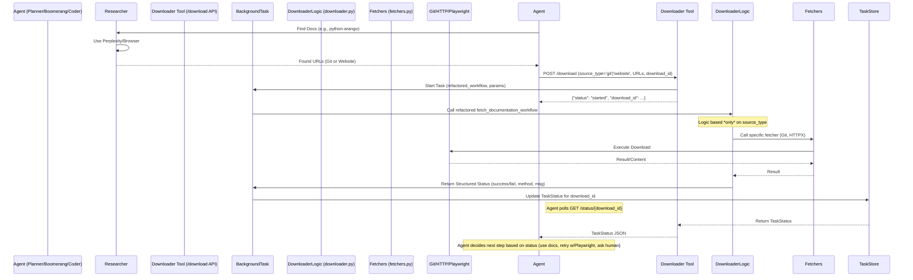

**`task.md` (Refactoring Plan)**

**Core Dependencies & Documentation Sources:**

*   **FastAPI:**
    *   Website: `https://fastapi.tiangolo.com/`
    *   Git Repo: `https://github.com/tiangolo/fastapi` (Note: Source code, not structured docs source like Markdown/RST usually)
*   **Pydantic:**
    *   Website: `https://docs.pydantic.dev/latest/`
    *   Git Repo: `https://github.com/pydantic/pydantic`
    *   Git Docs Path: `docs/` (Contains .md files)
*   **HTTPX:**
    *   Website: `https://www.python-httpx.org/`
    *   Git Repo: `https://github.com/encode/httpx`
    *   Git Docs Path: `docs/` (Contains .md files)
*   **Playwright Python:**
    *   Website: `https://playwright.dev/python/docs/intro`
    *   Git Repo: `https://github.com/microsoft/playwright-python` (Note: Docs source might be complex/not easily downloadable as MD/RST)
*   **BeautifulSoup4:**
    *   Website: `https://www.crummy.com/software/BeautifulSoup/bs4/doc/`
    *   (Git source less relevant for typical usage, website is primary)
*   **ArangoDB (Server):**
    *   Website: `https://docs.arangodb.com/stable/`
    *   Git Repo (Hugo Sources): `https://github.com/arangodb/docs-hugo`
    *   Git Docs Path: `site/content/` (Contains .md files, check branch for version)
*   **python-arango (Driver):**
    *   Website: `https://docs.python-arango.com/en/main/`
    *   Git Repo: `https://github.com/arangodb/python-arango`
    *   Git Docs Path: `docs/` (Contains .rst files)
*   **Loguru:**
    *   Website: `https://loguru.readthedocs.io/en/stable/`
    *   Git Repo: `https://github.com/Delgan/loguru`
    *   (Docs source likely RST within repo, path might need verification if Git download needed, website often sufficient)
*   **uv (Tooling):**
    *   Website: `https://astral.sh/docs/uv`
    *   Git Repo: `https://github.com/astral-sh/uv`
    *   Git Docs Path: `docs/` (Contains .md files)

*(Note: Agents should prioritize Git source + path if available and instructed, otherwise use the Website URL. Git paths are estimates and might need refinement).*

**Context:** This section provides known documentation sources for core project dependencies. Agents (Boomerang, Coder) should consult this list first before requesting research for these specific items. The `Researcher` agent should focus on finding sources for libraries *not* listed here.

---
**Core Components Affected:**

*   `src/mcp_doc_retriever/downloader.py` (Major Refactoring)
*   `src/mcp_doc_retriever/models.py` (API Model Changes)
*   `src/mcp_doc_retriever/main.py` (API Endpoint/Background Task Update)
*   `README.md` (Documentation Update)
*   `scripts/` (Test Script Updates)
*   `.roomodes` & `.roorules` (Implicitly, by defining the Agent/Tool interaction)

**Agent Invocation Flow (Target):**

1.  **Planner/Boomerang** identifies a need for documentation related to a task (e.g., using `python-arango`).
2.  **Boomerang** delegates to **`Researcher`**: "Find the official documentation source (Git repo URL/path preferred, fallback to Website URL) for the following packages: `python-arango`, `arangodb`, `loguru` [or others relevant to the task]."
3.  **Researcher** uses its tools (Perplexity, Browser) to find the information and reports back a structured result (e.g., `{"package": "python-arango", "git_url": "...", "git_path": "...", "website_url": "..."}`). If unsuccessful after trying, Researcher reports failure or asks Human via Boomerang/Planner.
4.  **Boomerang/Coder** receives the research results.
5.  **Boomerang/Coder** calls the **`doc_download` tool** (the `/download` endpoint of this service) with *explicit* instructions based on the Researcher's findings:
    *   If Git source found: `{"source_type": "git", "repo_url": "...", "doc_path": "...", "download_id": "..."}`
    *   If only Website found: `{"source_type": "website", "url": "...", "depth": N, "download_id": "..."}` (Agent chooses depth, likely starting low).
6.  **Downloader Tool** executes *only* the requested method.
7.  **Downloader Tool** returns status via `/status` endpoint updates (`completed`/`failed`, method attempted, error details).
8.  **Boomerang/Coder** monitors status. If `failed`:
    *   If method was `"http"` (for `source_type="website"`), Agent might decide to retry by calling the downloader *again* with `source_type="playwright", "url": "..."`.
    *   If method was `"git"` or `"playwright"`, or the retry fails, Agent escalates (back to Researcher for better URL, or to Human).

**Refactoring Task Plan:**

---

**Phase 1: Planning & Model Definition**

*   [X] **Task 1.1: Define New API Request Model**
    *   Action: In `src/mcp_doc_retriever/models.py`, define a new Pydantic model (e.g., `DocDownloadRequest`) that reflects the explicit `source_type` input and conditional URL fields. Ensure validation (e.g., if `source_type` is 'git', `repo_url` and `doc_path` are required).
    *   Deliverable: Updated `models.py` with the new request model definition and necessary validators.
*   [X] **Task 1.2: Define Workflow Return Structure**
    *   Action: Document (e.g., in the refactored function's docstring or a design note) the exact structure of the dictionary that the *refactored* `fetch_documentation_workflow` function will return (e.g., `{"status": "completed"|"failed"|"requires_playwright", "method": "git"|"http"|"playwright", "message": str, "error_details": Optional[str], "download_id": str}`).
    *   Deliverable: Documented return structure definition.

---

**Phase 2: Downloader Refactoring (`downloader.py`)**

*   [X] **Task 2.1: Remove Old Logic**
    *   Action: Remove the `detect_site_type` function entirely. Remove the internal Perplexity API call logic and associated parsing from `fetch_documentation_workflow`. Remove the logic that automatically triggers Git download based on the internal Perplexity call.
    *   Deliverable: `downloader.py` cleaned of heuristic/internal lookup logic.
*   [ ] **Task 2.2: Refactor `fetch_documentation_workflow` Signature & Core Logic**
    *   Action: Modify the signature of `fetch_documentation_workflow` to accept the new parameters defined in Task 1.1 (`source_type`, `repo_url`, `doc_path`, `website_url`, `depth`, etc.) instead of the old single `docs_url`. Implement the main conditional logic based on `source_type`.
    *   Deliverable: `fetch_documentation_workflow` with updated signature and primary `if/elif/else` structure based on `source_type`.
*   [ ] **Task 2.3: Implement Explicit Method Calls**
    *   Action: Within the `fetch_documentation_workflow` logic:
        *   If `source_type == "git"`, call the existing `_download_static_source_git` helper function (ensure it exists and is suitable or refactor it slightly if needed).
        *   If `source_type == "website"`, call `start_recursive_download`, explicitly passing `use_playwright=False`.
        *   If `source_type == "playwright"`, call `start_recursive_download`, explicitly passing `use_playwright=True`.
    *   Deliverable: Correct invocation of download methods based on `source_type`.
*   [ ] **Task 2.4: Implement Structured Return**
    *   Action: Ensure `fetch_documentation_workflow` captures success/failure from the underlying download methods (`_download_static_source_git`, `start_recursive_download`) and constructs/returns the structured dictionary defined in Task 1.2, including accurate `status`, `method`, `message`, and `error_details`. Ensure `download_id` is included.
    *   Deliverable: `fetch_documentation_workflow` returns the defined structured status dictionary.

---

**Phase 3: API & Background Task Integration (`main.py`, `models.py`)**

*   [ ] **Task 3.1: Update API Endpoint Request Handling**
    *   Action: In `main.py`, update the `/download` endpoint function signature to accept the new `DocDownloadRequest` model (from Task 1.1). Update the Pydantic dependency in `models.py` if needed.
    *   Deliverable: `/download` endpoint accepts the new request structure.
*   [ ] **Task 3.2: Update Background Task Invocation**
    *   Action: In `main.py`, modify the `run_download_task` wrapper (or whatever function is called by `background_tasks.add_task`). It needs to:
        *   Accept the new parameters (`source_type`, `repo_url`, etc.) passed from the `/download` endpoint.
        *   Call the refactored `fetch_documentation_workflow` with these new parameters.
        *   Receive the structured dictionary returned by the refactored workflow.
        *   Update the `TaskStatus` in the `DOWNLOAD_TASKS` dictionary based on the *final* status returned by the workflow (e.g., map the workflow's return `status` and `message`/`error_details` to the `TaskStatus` model fields).
    *   Deliverable: Background task correctly invokes the refactored workflow and updates the persistent task status based on its detailed return value.

---

**Phase 4: Testing & Documentation**

*   [ ] **Task 4.1: Update/Create API Test Script**
    *   Action: Update `scripts/test_api.py` (or create `scripts/test_refactored_api.py`) to test the *new* `/download` endpoint behavior. Include tests for:
        *   Submitting a `source_type="git"` request (requires a public test repo/path).
        *   Submitting a `source_type="website"` request for a known static site.
        *   Submitting a `source_type="playwright"` request for a known JS site (or the same static site to test invocation).
        *   Polling `/status/{download_id}` and verifying the final status/method reported matches the request.
        *   Testing failure cases (e.g., invalid Git URL, website 404).
    *   Deliverable: Test script validating the refactored API interaction.
*   [ ] **Task 4.2: Update Documentation (`README.md`, Docstrings)**
    *   Action: Update `README.md`:
        *   Revise the API Usage section for `/download` to show the new request body (`source_type`, etc.).
        *   Explain the removal of auto-detection/fallback and the new explicit Agent-Tool interaction model.
        *   Update the architecture diagram/description if significantly changed.
        *   Update the Roomodes Workflow description to mention the Researcher -> Downloader flow.
    *   Action: Update docstrings in `downloader.py` (especially `fetch_documentation_workflow`), `main.py` (`/download`), and `models.py` (`DocDownloadRequest`) to reflect the changes.
    *   Deliverable: Updated `README.md` and relevant docstrings.
*   [ ] **Task 4.3: Phase Verification, Demo & Finalization**
    *   **Goal:** Verify the refactored downloader logic, API, and Agent interaction model.
    *   **Actions:** Review code changes, run the updated test script, demonstrate the new API calls (e.g., using `curl` or the test script) for different `source_type` values, show the resulting status updates via `/status`, explain the updated README and the new intended workflow involving the Researcher agent. Perform `git add .`, `git commit -m "Refactor: Implement Agent-Led Downloader Workflow"`, `git tag v0.5-refactor` (adjust version as needed), update lessons learned if applicable.
    *   **Deliverable:** Confirmation of successful refactoring, updated tests passing, updated documentation, demo showcasing the new interaction model.

---