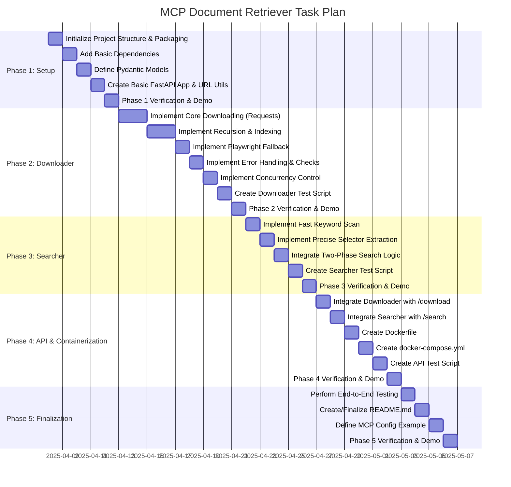

Objective: Develop an MCP-compatible service (mcp-doc-retriever) using FastAPI, packaged in a Docker container. This service will recursively download website content starting from a given URL, storing files in a mirrored site structure (like wget). It uses requests primarily, with automatic Playwright fallback for detected JS-heavy pages. It avoids re-downloading existing files by path unless forced (`--force`), handles common errors, and provides a two-phase search capability across the downloaded content: a fast keyword scan on decoded text, followed by precise selector-based text extraction on candidate pages identified via an index file.

Core Components:

*   API Interface: FastAPI server (/download endpoint, /search endpoint, /health).
*   Downloader Engine: Handles recursive fetching, requests/Playwright auto-fallback, `--no-clobber` (path-based)/`--force` logic, error handling, saving files in mirror structure, maintaining an index file per download job. Must be asynchronous with concurrency limits.
*   Search Engine: Implements the two-phase search using the download job's index file:
    1.  Fast keyword scan on decoded text content of candidate files.
    2.  Precise text extraction using BeautifulSoup (CSS selectors) on candidate files.
*   Input/Output Models: Pydantic models (DownloadRequest, DownloadStatus, SearchRequest, SearchResultItem, SearchResponse, IndexRecord).
*   Containerization: Dockerfile (including playwright install) and docker-compose.yml with volume mapping.
*   Packaging: Standard pyproject.toml and uv for dependency management.
*   File Storage:
    *   Content: `/app/downloads/content/{hostname}/{path}/{filename}.html` (mirrored structure).
    *   Index: `/app/downloads/index/{download_id}.jsonl` (maps URLs to local paths, content MD5, status).
*   Documentation: Sparse download of library docs, specific header comments, inline examples, lessons_learned.json.
*   File Size Limit: <= 500 lines per Python file where feasible.

Recovery Plan (If Session Crashes):

1.  Identify Last Completed Task: Review this task plan document ([X] marker).
2.  Identify Next Task: Resume development at the next task marked [ ].
3.  Restart Process: Relaunch the development environment. Ensure Docker (`docker compose up -d`) is running if needed.
4.  Continue Development: Proceed with the next task.

---

**Task Plan Visualization**

---

**Final Task Plan: mcp-doc-retriever Development**

**Phase 1: Project Setup & Core Dependencies**

*   [X] **Task 1.1: Initialize Project Structure & Packaging**
    *   Action: Create directory structure (`src/mcp_doc_retriever`, `scripts`, `repo_docs`, `src/mcp_doc_retriever/docs`), `pyproject.toml`, `.gitignore`. Initialize `uv`. Create placeholder `src/mcp_doc_retriever/docs/lessons_learned.json`.
    *   Deliverable: Project directory structure, `pyproject.toml`, `lessons_learned.json`.
*   [ ] **Task 1.2: Add Basic Dependencies**
    *   Action: Add FastAPI, Uvicorn, Pydantic, Requests, BeautifulSoup4, lxml, Playwright using `uv add`. (Playwright browser install handled in Dockerfile).
    *   Deliverable: Updated `pyproject.toml`, `uv.lock`. Confirmation of dependency installation locally (if tested).
*   [ ] **Task 1.3: Define Pydantic Models**
    *   Action: Create `src/mcp_doc_retriever/models.py`. Define API models (`DownloadRequest`, `DownloadStatus`, `SearchRequest`, `SearchResultItem`, `SearchResponse`). Define internal `IndexRecord` model (fields: `original_url`, `canonical_url`, `local_path`, `content_md5`, `fetch_status`, `http_status`, `error_message`). Ensure `DownloadStatus` includes `download_id`.
    *   Deliverable: `src/mcp_doc_retriever/models.py` with defined models.
*   [ ] **Task 1.4: Create Basic FastAPI App & URL Utils**
    *   Action: Create `src/mcp_doc_retriever/main.py` with basic app instance, placeholder endpoints (`/download`, `/search`), and `/health`. Create `src/mcp_doc_retriever/utils.py` with functions for: URL canonicalization (lowercase scheme/host, remove default ports/fragments), generating `download_id` (MD5 of canonical start URL), generating local file path from canonical URL.
    *   Deliverable: `main.py` with basic app/placeholders. `utils.py` with helper functions.
*   [ ] **Task 1.5: Phase 1 Verification, Demo & Finalization**
    *   **Goal:** Verify project setup, dependencies, models, basic FastAPI app, and utility functions. Demonstrate project structure, models, running basic FastAPI app showing endpoints, and testing utility functions (URL canonicalization, ID generation, path generation). Explain basic setup.
    *   **Actions:** Review artifacts, perform demo, `git add .`, `git commit -m "Complete Phase 1: Project Setup & Basic FastAPI"`, `git tag v0.1-setup`, potentially update lessons learned.
    *   **Deliverable:**
        *   Project directory structure (`src/mcp_doc_retriever`, `scripts`, `repo_docs`, `src/mcp_doc_retriever/docs`) created.
        *   `pyproject.toml` and `.gitignore` files created and configured.
        *   `uv` initialized and basic dependencies (FastAPI, Uvicorn, Pydantic, Requests, BeautifulSoup4, lxml, Playwright) added.
        *   Placeholder `src/mcp_doc_retriever/docs/lessons_learned.json` created.
        *   Basic FastAPI app in `main.py` runs and placeholder endpoints are accessible.
        *   Demo showcasing project structure and basic FastAPI app running.

---

**Phase 2: Downloader Implementation**

*   [ ] **Task 2.1: Implement Core Downloading Logic (Requests) & Storage**
    *   Action: Create `src/mcp_doc_retriever/downloader.py`. Implement async function `fetch_single_url_requests`. Takes canonical URL, target local path, force flag. Uses `requests`. Handles basic connection/HTTP errors. Calculates MD5 hash of content. Saves content to the specified `local_path` (mirror structure) if `--no-clobber` check (path existence) passes or `force=True`. Returns status, content MD5, detected links.
    *   Deliverable: `downloader.py` with `fetch_single_url_requests`, basic error handling, path-based clobber logic, mirror storage, MD5 calculation.
*   [ ] **Task 2.2: Implement Recursive Download Orchestration & Indexing**
    *   Action: Implement main async orchestrator function `start_recursive_download`. Takes start URL, depth, force flag, `download_id`. Creates/opens index file (`/app/downloads/index/{download_id}.jsonl`). Manages queue/set of visited canonical URLs. Calls fetch function (initially `fetch_single_url_requests`). Extracts links, canonicalizes them, checks domain/subdomain policy, checks depth, checks `robots.txt` (`utils.py` helper needed). Appends `IndexRecord` to index file for each attempt (success/failure). Respects concurrency limits (see Task 2.6).
    *   Deliverable: Updated `downloader.py` with recursive orchestration logic, domain/depth checking, `robots.txt` checking helper call, index file writing.
*   [ ] **Task 2.3: Implement Playwright Fallback & Auto-Detection**
    *   Action: Implement async function `fetch_single_url_playwright`. Add logic to `start_recursive_download` (or a wrapper around fetch functions) to: a) Use Playwright if `use_playwright=True` from API, b) Automatically retry with Playwright if `fetch_single_url_requests` returns content matching the heuristic (e.g., <1024 chars AND contains `
`/`
` with little other body). Manage Playwright resources. Update index record on retry/success/failure.
    *   Deliverable: Updated `downloader.py` with `fetch_single_url_playwright` and automatic fallback logic based on heuristic.
*   [ ] **Task 2.4: Implement Error Handling & Basic Checks**
    *   Action: Enhance fetch functions and orchestration logic. Handle timeouts. Implement basic login/paywall check heuristic (scan content for "Login", "Sign In", password fields) and update index record status if detected. Log errors clearly. Ensure fetch status (`success`, `failed_request`, `failed_robotstxt`, `failed_paywall`, etc.) is recorded in the index file.
    *   Deliverable: Enhanced `downloader.py` with improved error handling and status reporting in index file.
*   [ ] **Task 2.5: Implement Concurrency Control**
    *   Action: Integrate `asyncio.Semaphore` into the recursive download orchestration logic. Use one semaphore for `requests` calls (limit ~10) and a separate one for Playwright calls (limit ~2-4).
    *   Deliverable: Updated `downloader.py` with semaphore-based concurrency limits.
*   [ ] **Task 2.6: Create Downloader Test Script**
    *   Action: Create `scripts/test_download.py` to test the `start_recursive_download` function directly. Requires setting up mock responses or pointing to safe local test URLs. Test recursion depth, force/no-clobber, basic Playwright trigger (manual flag), index file creation/content.
    *   Deliverable: `scripts/test_download.py`.
*   [ ] **Task 2.7: Phase 2 Verification, Demo & Finalization**
    *   **Goal:** Verify downloader logic, including recursion, indexing, fallback, concurrency, and error handling via code review and test script. Demonstrate running `test_download.py` showing mirror structure creation, index file content, and explaining the key logic paths (requests, playwright fallback, concurrency limits).
    *   **Actions:** Review code/tests, perform demo, `git add .`, `git commit -m "Complete Phase 2: Downloader Implementation"`, `git tag v0.2-downloader`, potentially update lessons learned.
    *   **Deliverable:**
        *   `downloader.py` file created with `fetch_single_url_requests` function implementing core downloading logic using `requests`.
        *   Recursive download orchestration logic implemented in `start_recursive_download` function, including domain/depth checking and `robots.txt` handling.
        *   Playwright fallback logic implemented in `fetch_single_url_playwright` and integrated into the download process.
        *   Basic error handling and checks (connection errors, paywall detection) implemented and index record status updated.
        *   Concurrency control using `asyncio.Semaphore` implemented for `requests` and Playwright.
        *   `scripts/test_download.py` created to test downloader functionality.
        *   Demo showcasing downloader functionality, including recursion, Playwright fallback (manual trigger), and index file creation.

---

**Phase 3: Searcher Implementation**

*   [ ] **Task 3.1: Implement Fast Keyword Scan**
    *   Action: Create `src/mcp_doc_retriever/searcher.py`. Implement function `scan_files_for_keywords`. Takes list of local file paths, list of scan keywords. For each path, opens file, *decodes HTML content to text* (handle encoding errors gracefully - log/skip), performs case-insensitive keyword search. Returns list of paths that contain *all* keywords.
    *   Deliverable: `searcher.py` with `scan_files_for_keywords` function using decoded text.
*   [ ] **Task 3.2: Implement Precise Selector Extraction (Text Only)**
    *   Action: Implement function `extract_text_with_selector`. Takes a single local file path, CSS selector, optional list of extract keywords. Parses HTML with BeautifulSoup. Finds elements matching selector. Extracts *text content* (`.get_text()`). If extract keywords provided, filters results keeping only those whose text contains *all* extract keywords (case-insensitive). Returns list of extracted text snippets.
    *   Deliverable: `searcher.py` with `extract_text_with_selector` function returning text only.
*   [ ] **Task 3.3: Integrate Two-Phase Search Logic & Index Lookup**
    *   Action: Create main search function `perform_search`. Takes `download_id`, scan keywords, selector, extract keywords. Reads the index file (`/app/downloads/index/{download_id}.jsonl`). Filters records for `fetch_status='success'` to get list of relevant `local_path` values. Calls `scan_files_for_keywords` with these paths. Calls `extract_text_with_selector` for each candidate path returned by the scan. Looks up `original_url` from the index file for each successful extraction. Structures final results as list of `SearchResultItem` (containing `original_url`, `extracted_content`).
    *   Deliverable: Integrated two-phase `perform_search` logic in `searcher.py` using index file lookup.
*   [ ] **Task 3.4: Create Searcher Test Script**
    *   Action: Create `scripts/test_search.py`. Requires sample downloaded files and a corresponding sample index file (`.jsonl`). Test the `perform_search` function: ensure index is read, scan filters correctly, selector extracts text, results include original URL.
    *   Deliverable: `scripts/test_search.py`.
*   [ ] **Task 3.5: Phase 3 Verification, Demo & Finalization**
    *   **Goal:** Verify the search logic via code review and test script. Demonstrate running `test_search.py` against sample data, showing index lookup, keyword scan filtering, selector-based text extraction, and correctly mapped original URLs in results. Explain the two-phase flow using the index.
    *   **Actions:** Review code/tests, perform demo, `git add .`, `git commit -m "Complete Phase 3: Searcher Implementation"`, `git tag v0.3-searcher`, potentially update lessons learned.
    *   **Deliverable:**
        *   `searcher.py` file created with `scan_files_for_keywords` function for fast keyword scanning.
        *   `extract_text_with_selector` function implemented for precise text extraction using CSS selectors and BeautifulSoup.
        *   Two-phase search logic integrated in `perform_search` function, utilizing index file lookup.
        *   `scripts/test_search.py` created to test searcher functionality.
        *   Demo showcasing search functionality, including keyword scan filtering, selector-based text extraction, and correct mapping of original URLs in results.

---

**Phase 4: API Integration & Containerization**

*   [ ] **Task 4.1: Integrate Downloader with /download Endpoint**
    *   Action: Update `main.py`. Implement `/download` endpoint. Canonicalize input URL, generate `download_id`. Return `{"status": "started", "download_id": "..."}` immediately. Use FastAPI's `BackgroundTasks` (or similar async pattern) to run the `start_recursive_download` function from `downloader.py` in the background. Pass necessary parameters (URL, depth, force, `download_id`). Handle immediate errors like invalid start URL format.
    *   Deliverable: Functional `/download` endpoint triggering background download task and returning immediate status.
*   [ ] **Task 4.2: Integrate Searcher with /search Endpoint**
    *   Action: Update `main.py`. Implement `/search` endpoint. Takes `SearchRequest`. Checks if index file for `download_id` exists. Calls `perform_search` function from `searcher.py`. Returns `SearchResponse` containing results or appropriate error (e.g., 404 if index not found).
    *   Deliverable: Functional `/search` endpoint calling search logic.
*   [ ] **Task 4.3: Create Dockerfile**
    *   Action: Create `Dockerfile`. Include Python setup, dependency install (`uv sync --frozen`), **`RUN playwright install --with-deps`** (installs browsers and needed OS libs), copy source code, set workdir, define volume mount point `/app/downloads`, expose port 8000, set entrypoint (`uvicorn`). Define `DOWNLOAD_BASE_DIR=/app/downloads`.
    *   Deliverable: `Dockerfile`.
*   [ ] **Task 4.4: Create docker-compose.yml**
    *   Action: Create `docker-compose.yml`. Define `mcp-doc-retriever` service. Build from context. Map ports (e.g., `8001:8000`). Define volume mapping `download_data:/app/downloads` (using a named volume `download_data` is often better than host path).
    *   Deliverable: `docker-compose.yml`.
*   [ ] **Task 4.5: Create API Test Script**
    *   Action: Create `scripts/test_api.py`. Make calls to `/download` (for a small, safe site), wait briefly (since status endpoint is V2), then call `/search` using the returned `download_id`. Verify expected structure of search results. Test `force` flag.
    *   Deliverable: `scripts/test_api.py`.
*   [ ] **Task 4.6: Phase 4 Verification, Demo & Finalization**
    *   **Goal:** Verify API integration and containerization. Review code, Dockerfile, compose file, and API test script results against the containerized service. Demonstrate `docker compose build`, `docker compose up`, running `test_api.py` (showing calls to `/download`, checking volume content via `docker exec` or host mount, calling `/search`), explaining container setup and volume persistence.
    *   **Actions:** Review artifacts/tests, perform demo, `git add .`, `git commit -m "Complete Phase 4: API Integration & Containerization"`, `git tag v0.4-docker`, potentially update lessons learned.
    *   **Deliverable:**
        *   `/download` endpoint in `main.py` integrated with `downloader.py` to trigger background download tasks.
        *   `/search` endpoint in `main.py` integrated with `searcher.py` to perform searches based on `download_id`.
        *   `Dockerfile` created, including Python setup, dependency installation, Playwright browser installation, and volume mount point definition.
        *   `docker-compose.yml` created to define the `mcp-doc-retriever` service with port mapping and volume definition.
        *   `scripts/test_api.py` created to test API endpoints and basic containerized service functionality.
        *   Demo showcasing API endpoints working, containerized service running via `docker compose`, and volume persistence.

---

**Phase 5: Final Testing, Documentation & Finalization**

*   [ ] **Task 5.1: Perform End-to-End Testing**
    *   Action: Enhance `scripts/test_api.py`. Test scenarios: download with depth, search misses, search with specific selectors, download failure (invalid URL), `force=true` download.
    *   Deliverable: Updated `test_api.py` and confirmation of successful execution.
*   [ ] **Task 5.2: Create/Finalize README.md**
    *   Action: Create/finalize `README.md` based on the updated structure/decisions. Detail features, setup, accurate API usage examples, key concepts (mirroring, index file, auto-fallback, two-phase search), MCP config, Roomodes context. Include Mermaid diagram.
    *   Deliverable: Comprehensive `README.md`.
*   [ ] **Task 5.3: Define MCP Server Configuration Example**
    *   Action: Add specific, accurate `mcp_settings.json` example to README, showing volume mapping (`download_data:/app/downloads`) and tool names (`doc_download`, `doc_search`).
    *   Deliverable: MCP configuration example section in `README.md`.
*   [ ] **Task 5.4: Phase 5 Verification, Demo & Finalization**
    *   **Goal:** Review E2E tests and README. Demonstrate running enhanced `test_api.py`, walk through the finalized README explaining key sections and updated concepts, showcase final service functionality.
    *   **Actions:** Review artifacts, perform demo, `git add .`, `git commit -m "Complete Phase 5: Final Testing & Documentation"`, `git tag v1.0-release`, potentially update lessons learned.
    *   **Deliverable:**
        *   Enhanced `scripts/test_api.py` with comprehensive end-to-end tests covering various scenarios (depth, search misses, selectors, failures, force flag).
        *   Comprehensive `README.md` finalized, detailing features, setup, API usage, key concepts, MCP configuration, and Roomodes context, including a Mermaid diagram.
        *   Accurate `mcp_settings.json` example added to `README.md` with volume mapping and tool definitions.
        *   Demo showcasing end-to-end testing using `test_api.py` and finalized documentation in `README.md`.
